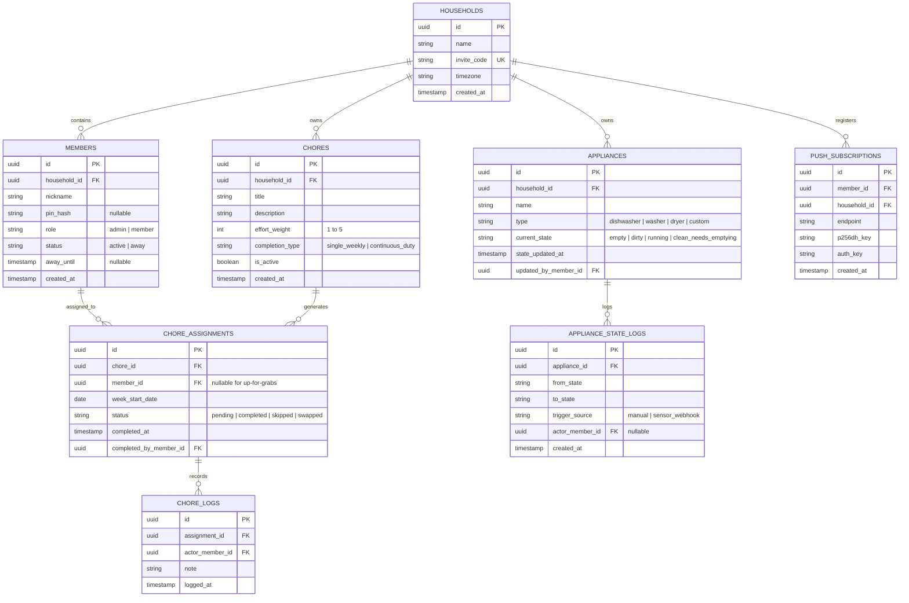

## Context

This project is a greenfield Household Coordination application tailored for shared roommate living. Living with roommates introduces daily friction points: ambiguous chore ownership, neglected duties, putting dirty dishes into clean dishwashers, and leaving wet clothes in washers. 

The goal of this design is to deliver a lightweight, self-hostable MVP that solves these friction points with zero onboarding barriers (no mandatory email/passwords or third-party cloud lock-in), live real-time sync, and native Web Push notifications across mobile and desktop browsers.

## Goals / Non-Goals

**Goals:**
- **Zero-Friction Roommate Onboarding**: Roommates join via a 6-character invite code, pick a nickname, and optionally set a 4-digit PIN.
- **Weekly Duty Chore Shifts**: Support weekly responsibility cycles with flexible completion timing, round-robin rotation, hybrid chore types (single completion vs. recurring instance logging), and an "Up for Grabs" pool for away roommates.
- **Real-Time Appliance State**: 4-state engine (`empty` -> `dirty` -> `running` -> `clean_needs_emptying`) with 1-tap toggles, live duration counters, actor activity history, and IoT sensor webhook compatibility.
- **Self-Hostable Architecture**: Simple Python (FastAPI) + PostgreSQL + React PWA stack deployable via Docker Compose on any standard VPS or home server.
- **Standard Web Push**: Background OS notifications via browser Push API and VAPID keypairs generated on the self-hosted backend.

**Non-Goals:**
- **Expense / Receipt Splitting**: Bill splitting (Splitwise clone) is deferred to a future milestone to prevent domain bloat.
- **Meal Planning / Grocery Inventory**: Pantries and recipe linking will be added in v2.
- **Native App Store Binaries**: iOS/Android store packages are omitted in favor of standard responsive PWA with Web Push.

## Architecture & System Overview

```
                      ┌────────────────────────────────────────────────────────┐
                      │                   React Frontend (PWA)                 │
                      │         (Vite + TypeScript + Tailwind CSS + PWA)       │
                      └───────────────────────┬────────────────────────────────┘
                                              │
                                              │ HTTP / JSON REST & WebSockets
                                              ▼
                      ┌────────────────────────────────────────────────────────┐
                      │                  FastAPI Backend Server                │
                      │    • Async Python 3.12+ / Pydantic v2 schemas          │
                      │    • Household-scoped WebSocket Connection Manager     │
                      │    • Web Push Dispatcher (pywebpush + VAPID)           │
                      │    • SQLAlchemy 2.0 Async ORM + Alembic migrations     │
                      └───────────────────────┬────────────────────────────────┘
                                              │
                                              │ asyncpg connection pool
                                              ▼
                      ┌────────────────────────────────────────────────────────┐
                      │                  PostgreSQL Database                   │
                      │   (Households, Members, Chores, Appliances, Logs)      │
                      └────────────────────────────────────────────────────────┘
```

## Decisions

### 1. Backend: Python FastAPI over Node/Go
- **Rationale**: Async-native, robust OpenAPI documentation auto-generation, clean Pydantic request/response validation, native WebSocket support, and standard Python libraries for Web Push (`pywebpush`).
- **Alternatives Considered**: 
  - *Node.js / Hono*: Fast, but Python was preferred by the project requirements.
  - *Go*: Fast and single-binary, but slower feature iteration compared to FastAPI.

### 2. Database: PostgreSQL with Multi-Household Scoping
- **Rationale**: Relational data integrity for foreign keys (`household_id`, `member_id`, `chore_id`), robust ACID transactions, and clean indexing. Schema is partitioned by `household_id` so a single deployed instance can serve multiple distinct households safely.
- **Alternatives Considered**: 
  - *SQLite*: Simple, but concurrent WebSocket writes and multi-tenant scaling are more robust with Postgres.

### 3. Real-Time Sync: In-Memory WebSocket Rooms per Household
- **Rationale**: FastAPI maintains active client connections mapped by `household_id`. Whenever a state mutation occurs (`POST /appliances/{id}/state`, `POST /chores/{id}/complete`), the handler broadcasts the event payload to all open sockets in that room.
- **Alternatives Considered**: 
  - *Redis PubSub*: Adds operational overhead unnecessary for single-container self-hosting. Can be swapped in later if horizontal clustering is required.

### 4. Authentication: Invite Codes + Nickname & Optional PIN
- **Rationale**: Roommates resist apps requiring email verification and password resets. A 6-character invite code + nickname + optional 4-digit PIN issues a signed HS256 JWT stored in `localStorage`, maintaining complete security without requiring an SMTP email relay.
- **Alternatives Considered**: 
  - *Email / Magic Links*: Requires setting up SendGrid/Resend/SMTP, which creates friction for self-hosters.

### 5. Chore Model: Weekly Duty Responsibility Shifts
- **Rationale**: Fixed calendar timestamps (e.g. "Take out trash at 3pm Tuesday") fail in roommate environments. Assigning a chore for the entire calendar week (e.g. Week 35: Person A is on trash duty; Person B cleans bathroom) provides flexibility while maintaining accountability.
- **Hybrid Tracking**:
  - `single_weekly`: One check-off per week (e.g. Bathroom Cleaning).
  - `continuous_duty`: Multiple completion logs per week (e.g. Trash Duty).

## Database Schema Design



## Risks / Trade-offs

- **[Risk] Roommates forgetting PINs** → *Mitigation*: Household Admins can reset or remove PINs for any member in the household settings.
- **[Risk] Multiple tabs / desynchronization** → *Mitigation*: WebSocket reconnects with automatic TanStack Query cache invalidation on focus/reconnection.
- **[Risk] Web Push browser restrictions on iOS** → *Mitigation*: On iOS, Web Push requires "Add to Home Screen" (PWA install). The UI includes a clear 1-tap helper prompt guiding iOS users to add the PWA to their home screen to enable push alerts.
- **[Risk] Docker hosting complexity** → *Mitigation*: Single `docker-compose.yml` with sensible defaults (Postgres volume, automatic migrations on startup).

## Migration Plan

1. **Phase 1**: Initialize repository structure with Docker Compose, FastAPI skeleton, and Postgres container.
2. **Phase 2**: Run Alembic migrations to establish initial schema.
3. **Phase 3**: Seed default appliance presets and sample chore definitions upon household creation.
4. **Phase 4**: Build React PWA frontend with full responsive views and service worker registration.
